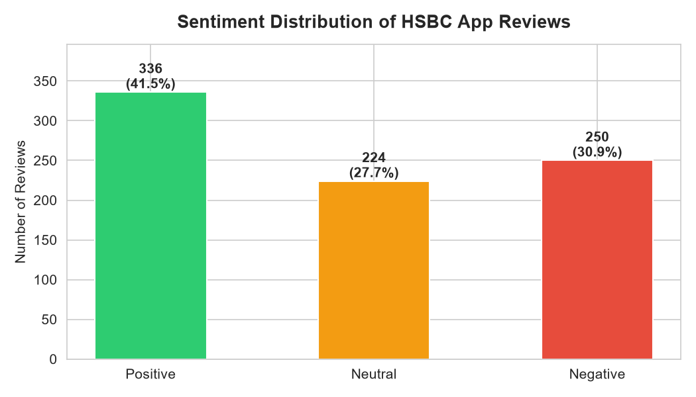
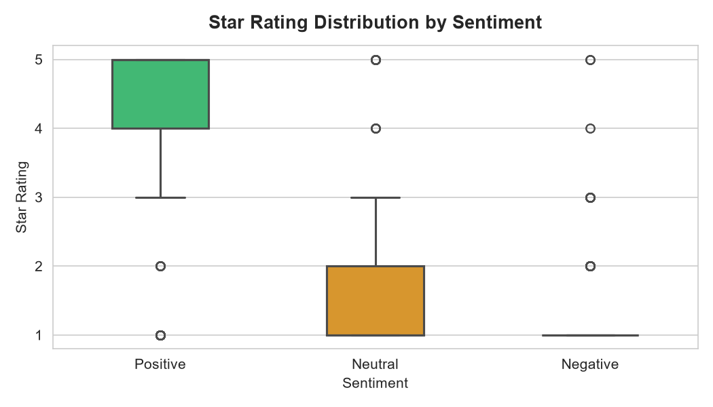
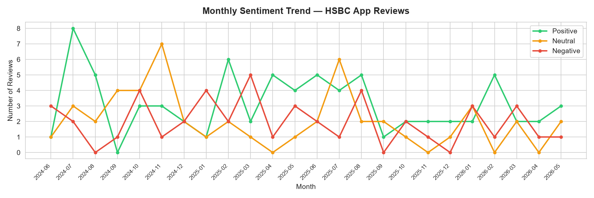
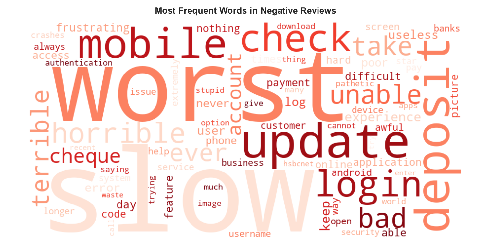

# HSBC App Sentiment Analysis
### Google Play Store Reviews | NLP & Data Analytics Portfolio Project

---

## Problem Statement
HSBC's mobile banking app (HSBCnet) has received mixed reviews on the Google Play Store.
This project analyses 810 user reviews to identify key sentiment drivers, recurring complaint
themes, and actionable insights for a customer experience and campaign analytics team.

---

## Methodology
1. **Data Collection** — Scraped 810 reviews using `google-play-scraper` (app: `com.hsbc.hsbcnet`)
2. **Data Cleaning** — Lowercased text, removed URLs, special characters, and noise words
3. **Sentiment Analysis** — Applied TextBlob polarity scoring; classified as Positive (>0.1), Negative (<-0.1), Neutral
4. **Keyword Extraction** — Frequency analysis on negative/positive reviews after stopword removal
5. **Visualisation** — Matplotlib/Seaborn charts + Power BI interactive dashboard

---

## Key Findings

| Metric | Value |
|--------|-------|
| Total Reviews Analysed | 810 |
| Positive Sentiment | 336 (41.5%) |
| Neutral Sentiment | 224 (27.6%) |
| Negative Sentiment | 250 (30.9%) |
| Avg Rating — Positive Reviews | 4.13 ⭐ |
| Avg Rating — Negative Reviews | 1.35 ⭐ |
| Overall Avg Rating | 2.62 ⭐ |

### Top Complaint Themes (Negative Reviews)
| Keyword | Mentions | Theme |
|---------|----------|-------|
| slow | 59 | Performance |
| worst | 44 | Negative Sentiment |
| update | 30 | Update Issues |
| deposit | 30 | Deposit Feature |
| login | 20 | Login/Auth |
| error | 11 | Login/Auth |

### Top Praise Themes (Positive Reviews)
- **Easy to use** — most frequent positive signal (52 mentions)
- **User friendly** — 29 mentions
- **Security** — users trust the app's authentication features (9 mentions)

---

## Business Recommendations
- **Performance** is the #1 complaint driver — 59 negative mentions of slowness directly
  correlate with 1-star ratings (avg 1.35). A performance improvement campaign targeting
  login and load speed could convert low-rating users.
- **Update reliability** — 30 negative mentions tied to broken functionality post-update.
  HSBC should implement staged rollouts with rollback capability.
- **Positive retention** — 41.5% of users are satisfied, primarily valuing simplicity and
  security. Retention messaging should reinforce these strengths.

---

## Tech Stack
| Tool | Purpose |
|------|---------|
| Python | Data collection, cleaning, analysis |
| google-play-scraper | Review scraping |
| pandas | Data manipulation |
| TextBlob | Sentiment analysis |
| NLTK | Stopword removal, keyword extraction |
| Matplotlib / Seaborn | Static visualisations |
| WordCloud | Negative keyword visualisation |
| Power BI | Interactive dashboard |
| Jupyter Notebook | Development environment |
| Git / GitHub | Version control |

---

## Project Structure

    hsbc-app-sentiment-analysis/
    ├── data/
    │   ├── hsbc_raw_reviews.csv
    │   ├── hsbc_cleaned_reviews.csv
    │   ├── hsbc_sentiment_reviews.csv
    │   └── hsbc_top_complaints.csv
    ├── notebooks/
    │   └── hsbc_sentiment_analysis.ipynb
    ├── visuals/
    │   ├── sentiment_distribution.png
    │   ├── rating_by_sentiment.png
    │   ├── sentiment_trend.png
    │   └── negative_wordcloud.png
    ├── dashboard/
    │   └── hsbc_sentiment_dashboard.pbix
    └── README.md

---

## Visualisations

### Sentiment Distribution

### Rating by Sentiment

### Monthly Sentiment Trend

### Negative Review Word Cloud

---

## Dashboard Preview
> Power BI dashboard saved in `dashboard/hsbc_sentiment_dashboard.pbix`

*(Add Power BI screenshot here)*

---

## Author
Mafijul Molla
Data Analyst | https://www.linkedin.com/in/mafijul | https://github.com/Mafijul-01
